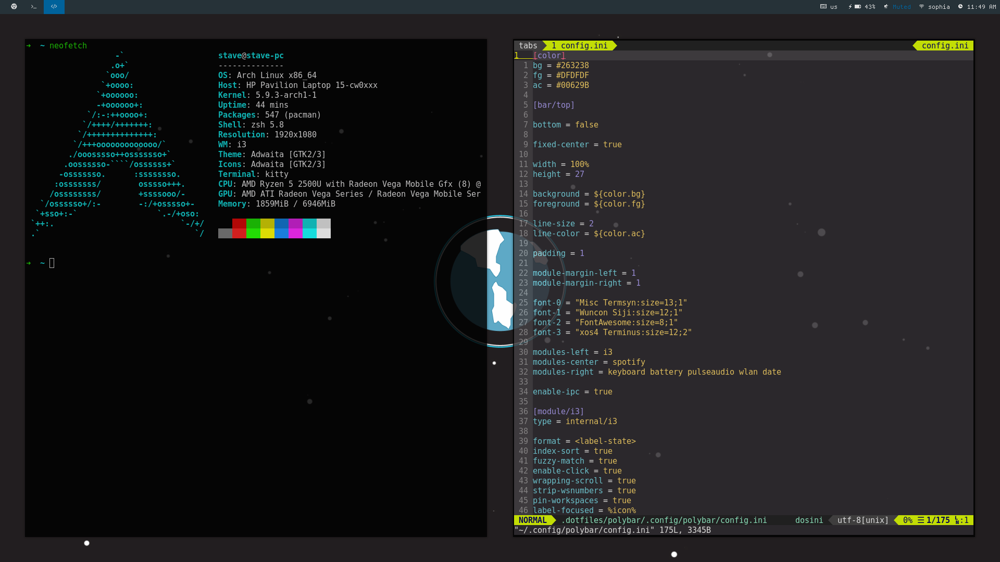

# .dotfiles
These are my dotfiles. I made this repository because I need them for backup. 

## Preview

## Default Applications

| Application    | Default |
|----------------|---------|
| Window Manager | i3-gaps |
| Terminal       | kitty   |
| Editor         | vim     |
| Notifications  | dunst   |
| Animations     | picom   |
| Bar            | polybar |
| File manager   | ranger  |

## Credits

Polybar theme is inspired by [Polybar-3](https://github.com/adi1090x/polybar-themes).

[Link](https://github.com/Jvanrhijn/polybar-spotify) for the original repository of the spotify script for polybar.
